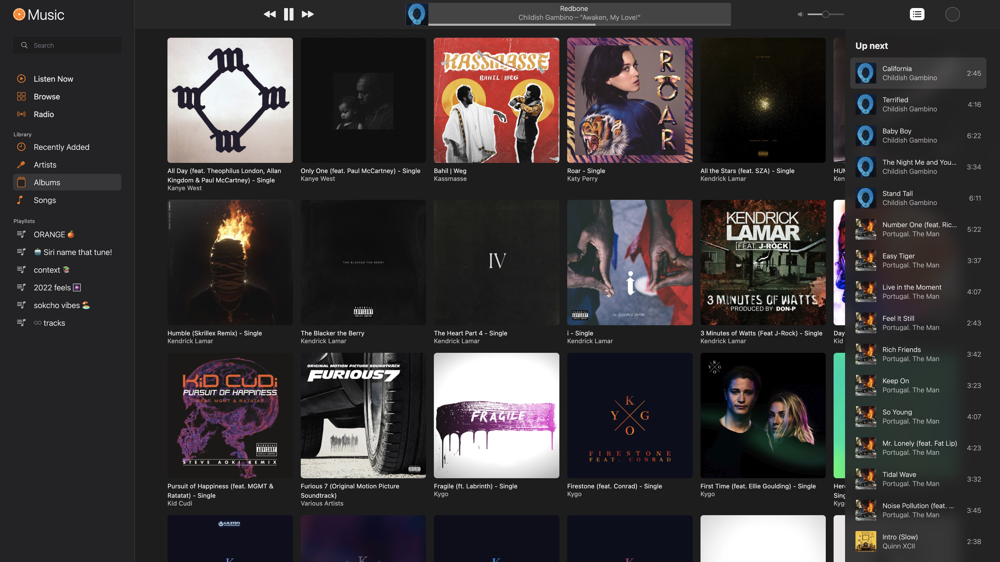

<div align="center"> 



A **Vue3** + **Electron** TypeScript based Apple Music clone application, including **ViteJS** and **Electron Builder**.
</div>

### About

An Apple Music clone desktop application made with Electron, Vue JS and Tailwind CSS that consumes the free Deezer API 
to collect track data and displays popular playlist with previews for each track.


#### Install dependencies & build native node modules

```bash
npm install
./node_modules/.bin/.electron-rebuild
```

#### Run the Development Server

```bash
npm run dev
```

#### Build and Package Commands

```bash
npm run build:win # uses windows as build target
npm run build:mac # uses mac as build target
npm run build:linux # uses linux as build target
```